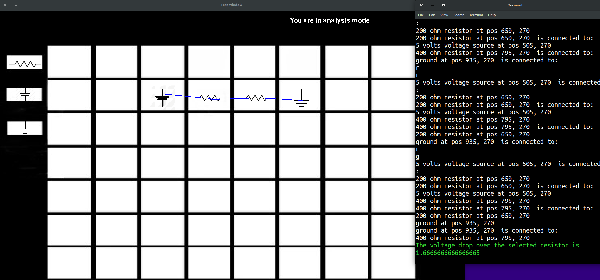

# Frank's Red Hot SPICE Software

### Demonstration Video

[Click here](https://youtu.be/kwTweYTBiVw) to watch our demonstration video!

### About Frank's Red Hot
Frank's Red Hot is a circuit analysis (or SPICE) software, named after Olin's beloved mascot, Frank.

[Click here](learn_more.md) to learn more about our project!

### Our Team
- Arwen Sadler - [@arwensadler](https://www.github.com/arwensadler)
- Aditya Sudhakar - [@aditya-sudhakar](https://www.github.com/aditya-sudhakar)
- Alexander Wenstrup - [@awenstrup](https://www.github.com/awenstrup)
- Mellie Zito - [@MellieZito](https://www.github.com/MellieZito)

[About Us](about_us.md)

