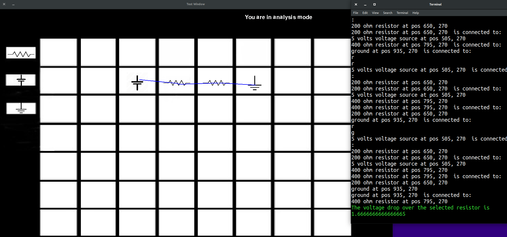

# About Frank's Red Hot

### Concept

Every first year at Olin has to take the class Introduction to Sensors, Instrumentation, and Measurement (ISIM). Within the first few classes, students are expected to design and build their own circuits given some resistors and capacitors - sometimes these calculations get tricky and hand-calcs can lead to mistakes, the smallest of which can lead to a disappointing wisp of smoke. A fix to the hand-calc problem was SPICE (Simulation Program with Integrated Circuit Emphasis) software, an archaic, clunky number cruncher which made calculations easier. Tired of seeing (and smelling) the classroom wide series of smoke signals, our team decided to make our own SPICE software with the intent of creating a simpler, more modern UI which would help ISIM students/circuit building enthusiasts build working circuits - the first time. 

### Process

We wanted to start by making a clean UI, so we researched different UI packages in Python. Since
none of them had everything we wanted, we decided to use PyGame, since it had a good documentation
and we all had experience with it. It lacks some functionality necessary for creating UI elements so we had to make some workarounds. Our biggest challenge was implementing a "click-and-drag" like feature for placing components. 

Our solution was to implement a fake "temporary" componenet which would continuously blit itself as a surface onto the screen underneath the mouse cursor. When the component is placed in a box in the grid, a conditional would be run that "snaps" the component into the center of the box. 

We also designed our components so that we could go back and edit their structure more easily. We spent a lot of time trying to abstract the code and implement good inheritance structure wherever possible to minimize repeated code. We have all of our componenets inheriting from our parent componenet class that contains most of the boilerplate for creating new components (see position, component type, field value). 

After creating resistors/voltage sources/ground that could be placed one per box, we began to implement the backend analysis. The first step was to We created a dictionary object to link all of the componenets and wires, which would allow the software to "understand" the location of components in relation to each other. Next we needed to take in resistor values from the user. They enter the values in the terminal. After all the resistors are placed, they can enter wire mode by pressing "w" and clicking on componenets to link them. Finally, the user enters analysis mode by pressing "a" and can click on a componenet to see the voltage drop across it:

Our biggest challenge with implementing the backend was time. We spent a lot of time trying to clean up the UI and with projects from other classes and other assignments in SoftDes, we decided to focus on making a working MVP - software that can understand the structure of a circuit and calculate voltage drops across resistors. Our final project looks like this:

Watch the project video [here](https://www.youtube.com/watch?v=kwTweYTBiVw&feature=youtu.be)

#### [Return to home page](index.md)
